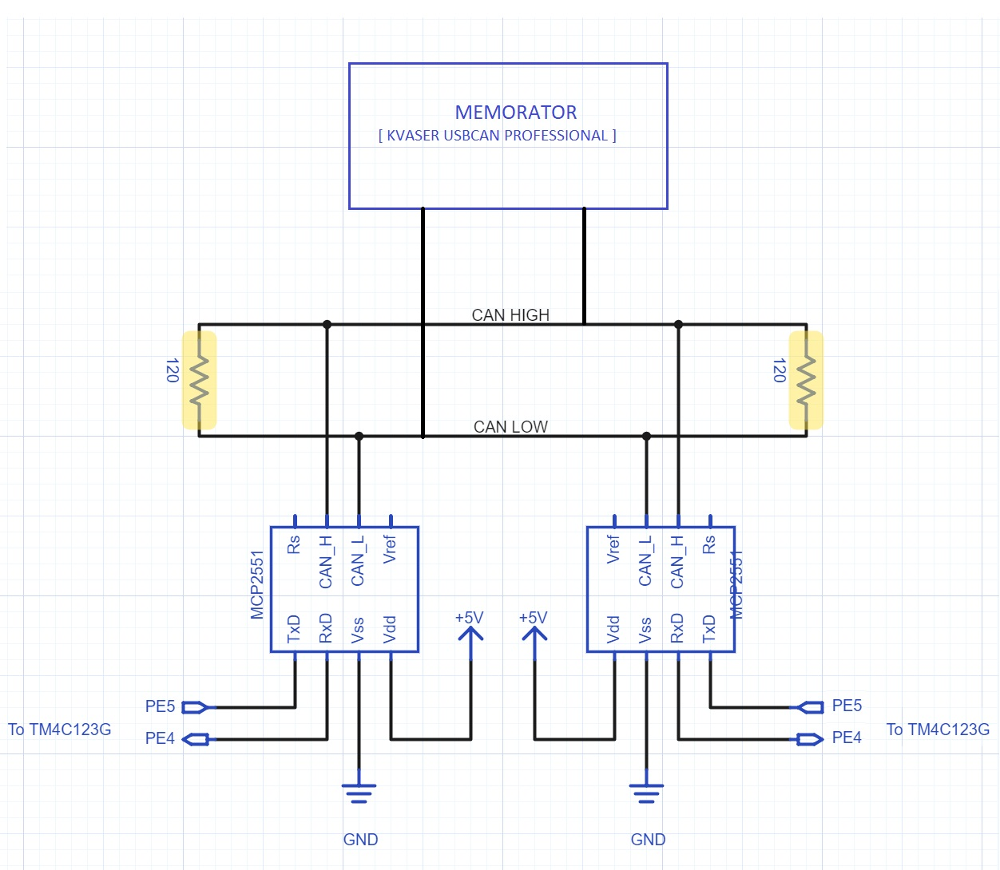

# can_tiva_launchpad
**Exploring different schemes of using CAN on Tiva Launchpad**

This project aims at exporing different ways CAN controller on Tiva Launchpad testing it across different CAN Frames transmission and reception.

Kvaser USBScan Professional acts as other CAN Controller. SocketCAN on Linux is used to receive and transmit messages via it and display on the terminal.

CAN Controller on TIVA Launchpad communicates on CAN Bus with Kvaser USBScan Professional and communicates with PC via UART.

can-utils ( which uses SocketCAN)  is used for generating,sending and displaying messages on PC Terminal.

To install can-utils, you can clone (or download) the master branch at https://github.com/linux-can/can-utils.
Then, build and install it.

    git clone https://github.com/linux-can/can-utils.git
    cd can-utils
    make
    sudo make install
    
Basic tools to display, record, generate and replay CAN traffic

    candump : display, filter and log CAN data to files
    canplayer : replay CAN logfiles
    cansend : send a single frame
    cangen : generate (random) CAN traffic
    cansniffer : display CAN data content differences (just 11bit CAN IDs)

Then, connect the Kvaser USBScan Professional (or any other CAN Controller) and setup CAN socket. Run can_setup.sh (included in the repository) as root.

    sudo ./can_setup.sh   # loads CAN module and sets up can0 and can1 with CAN bitrate set to 500000

**Mode 1 (Rx)** : In this mode, Tiva Launchpad works as a receiver on the CAN Bus and receives all the messages on the CAN Bus and log it.

**Mode 2 (TX)** : In this mode, Tiva Launchpad works as a transmitter on the CAN Bus and transmits messages on the CAN Bus with a single or multiple IDs and hence compete on CAN Bus according to message identifier. Lower the message identifier, higher the priority of the message.

**Mode 3 (RTR Query)** : In this mode, Tiva Launchpad sends a remote frame on the CAN Bus with no data and message identifier being the identifier of the node which it is requesting to transmit.

**Mode 4 (RTR Response)** : In this mode, if Tiva Launchpad receives a remote frame on the CAN Bus with no data and message identifier being its message identifier, then it responds with the appropriate data frame.

In our project, we have explored all the 4 modes on Tiva Launchpad.
Commands are to be entered in UART shell.

**Mode 1** : Here, Tiva Launchpad acts as CAN Bus sniffer which just continuously listens to the messages on the network which are randomly generated by Kvaser Memorator.

**Mode 2** : Here, Tiva Launchpad generates messages (date and time) continuously and Kvasaer Memorator listens to the messages on the network.
            
**Mode 3** : Here, Tiva launchpad sends a remote frame on the network with the identifier either being the identifier of Memorator or other Tiva Launchpad on the network. In case, it is the identifier of the memorator, it just receives the remote request because it is not programmed to respond. When the identifier matches the identifier of the other CAN node ( Tiva Launchpad on the network, it responds with current date and time by requesting RTC(Real-time clock) on it by I2C communication.

**Mode 4** : Here, Tiva launchpad responds with date and time on being sent remote frame by Kvaser Memorator or other Tiva Launchpad.

So, a remote I2C peripheral can be accessed over CAN Bus.

**To build project, clone or download the repository and run make**. 
Also include libraries (**libdriver.a** and **libuarstdio.a**) present in the lib folder in your library path.
There are two options for building the project.

    make                             # to build Univerasl Transmitter and Receiver
    make I2C_RTC=1                   # to build for sending date and time over CAN and responds to remote request

Then, download it to the Launchpad.

**Commands to run on Tiva Launchpad**

    1) bitrate <bitrate> : sets can bitrate as <bitrate> (default bitrate = 500000)
    2) generate : gets date and time from I2C data from RTC and send it as CAN message in CAN data frame after every 10 seconds
    3) stop : stops the generation of continuous CAN frames (started by generate) 
    4) send <id>#<data> : sends <data> as data with <id> as message id 
    5) send <id>#R6 : sends remote frame with identifier being <id>

**Commands to run on can0 for CAN Controller**

    1) cangen can0 : generates random traffic over CAN BUS with random message ids and data (To be used in mode 1)
    2) cansend can0 <id>#<data> : sends <data> as data with <id> as message id (To be used in mode 2)
    3) candump can0 : dumps all messages over the CAN BUS received by can0 or sent by can0 (To be used in all modes to see the network traffic)
    4) cansend can0 <id>#R6 : sends remote frame with identifier being <id> (To be used in mode 4)
